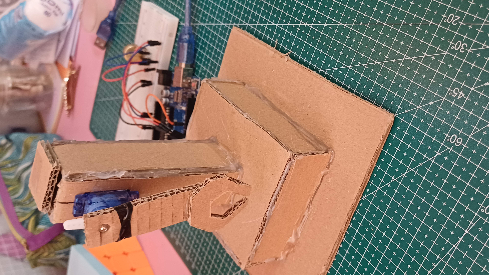

# Day 02 Reflection: From 3D Design to Physical Construction

## 1. Objective
The goal for today was to translate the 3D Tinkercad model into a physical prototype using cardboard, focusing on mechanical stability and the integration of the servo motor.

## 2. Mechanical Design & Construction
I followed the 1-DOF (Degree of Freedom) design, consisting of three main parts:
* **The Base (150mm x 150mm):** Provides a low center of gravity to prevent tipping.
* **The Support Tower:** A sturdy vertical structure built to house the SG90 servo.
* **The Moving Link (Arm):** A 140mm cardboard arm designed for maximum reach and minimum weight.

### Key Challenges in Construction:
* **Precision Cutting:** Using a craft knife to create the servo slot was tricky. It had to be tight enough to hold the motor without excessive play.
* **Structural Integrity:** I used hot glue to reinforce all right-angle joints, ensuring the tower doesn't wobble when the arm moves rapidly.

## 3. The Pivot Joint (The "Secret Sauce")
The most critical part of Day 2 was the coupling between the servo and the cardboard arm.
* I embedded the **Servo Horn** directly into the cardboard arm by carving a shallow recess.
* **Hot glue** was used to fuse the plastic horn with the cardboard fibers, creating a high-torque connection.
* A locking screw was added to ensure the arm doesn't fly off during high-speed sweeps.

## 4. Learning Outcomes
* **Material Strength:** Learned how to utilize the "grain" of the cardboard for better bending resistance.
* **Center of Mass:** Realized that a wider base is essential for any robot arm, even a small 1-DOF one.
* **Iteration:** The physical model required slight adjustments from the Tinkercad version to account for the thickness of the glue and cardboard layers.
## Project Gallery
| Construction Phase | Component Detail | Finished Prototype |
| :--- | :--- | :--- |
|  |  |  |

## Live Demo (Mechanical Test)
In this video, I am testing the full 180-degree range of motion. The arm moves smoothly, and the cardboard base remains perfectly stable even at the limits of the sweep.

*(Please click the button above to view the detailed operation of the robotic arm.)*

---
**Developed by:** Tran Hong Vy Ai
**Date:** Arpil 22, 2026
